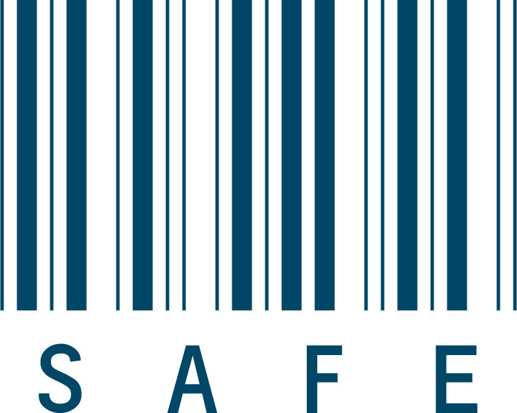

# IDEA

## SAFE
### Tu tranquilidad nos importa

> [Demo SAFE](https://villarrealscarlette.github.io/SCL010-Cipher/src/index.html)

**Safe** es una aplicación que permitirá a nuestros usuarios recibir y gestionar la información de retiro (fecha, direccion surcursal, horario, entre otro) correspondiente al servicio de transporte de valores con sus clientes, de forma segura a través de mensajes codificados, manteniendo la **confidencialidad** de los datos logísticos.  

## Cliente Safe

Empresas prestadoras de servicio de recaudación y traslado de valores, suministro de cambio y gestión de depósitos en instituciones financieras.

### Usuarios
Se identifican 2 tipos de usuarios
- En una empresa prestadora de servicio: Personal encargado de la gestión de requisitos efectuados por sus clientes
- En una empresa contratadora de servicio: Personal encargado de la gestión de requerimiento del servicio de retiro de valores

#### Objetivos de Usuario
> Safe es una aplicación que permite fortalecer la relación entre empresas prestadoras de servicio de transporte de valores y sus clientes, empresas que requieran de la mayor seguridad que un servicio les pueda brindar. 
- Para una empresa contratadora de servicio: Codificar la información referida a un requerimiento de retiro de valores, para luego enviarla de forma segura (a través de e-mail) a su proveedor de servicio
- Para una empresa prestadora de servicio: Descrifrar la información enviada por su cliente (a través de e-mail) para iniciar un requisito de servicio logistico
#### Proceso de usuarios
Al acceder como "Cliente" el usuario se deberá identificar con el RUT de la empresa a la cual representa para iniciar un requerimiento, luego podrá igresar los datos espeficos como fecha, dirección de sucursal, jefe de sucursal, horario entre otros, de su requerimiento de servicio para luego codificarlos y obtener así una información compleja de descrifrar. Finalmente, el usuario copia la nueva información y la ingresa en un e-mail para terminar con el requerimiento de servicio que será enviado a la empresa proveedora

Al acceder como "Trabajador Safe" deberá identificar el requisito de servicio a un cliente, para lo cual deberá ingresar el RUT de cliente contenido en el e-mail (o en sus archivos) junto con la información codificada, la cual procede a decodificar mediante la aplicación, obteniendo los datos necesarios para gestionar el requisito de servicio del cliente

## ¿Por qué nace Safe?
Safe nace a partir de la necesidad de resguardar la información especifica referida al retiro de valores de una empresa con su proveedor de servicio, con la finalidad de proteger la confidencialidad de los datos y restringuir el manejo de la información, además de evitar su maluso 

### Visión
Entregar una aplicación que permita aumentar el valor de sus clientes a través de la prestación de un servicio seguro y confiable para sus relaciones comerciales.

### Misión
Trabajar en conjunto con sus clientes para realizar optimizaciones a la aplicación en base a sus necesidades, desarrollando tecnologia de altos estandares en seguridad sumado a la entrega de soporte y capacitación constante.

# Resumen del Proyecto

Safe utiliza una de las técnicas más simples para cifrar un mensaje: El [Cifrado Cesar](https://en.wikipedia.org/wiki/Caesar_cipher). Este es un tipo de cifrado por sustitución, es decir que cada letra del texto original es reemplazada por otra que se encuentra un número fijo de posiciones (desplazamiento) más adelante en el mismo alfabeto.

## Planificación
Fue realizada a través de la plataforma Trello, haciendo el uso de tableros, los cuales contuvieron las tareas a llevar a cabo para la entrega del proyecto. Como también mediante _dailys_ diarios al inicio de cada jornada

## Prototipo
El [prototipo](src/prototiposafe.jpg) indica el flujo de interacción del usuario con la aplicación

## Boceto
El [boceto](src/bocetosafe.jpg) muestra el diseño inicial considerado para la aplicación

## Cómo usar la aplicación
- Acceder a la aplicación a través del [link](https://villarrealscarlette.github.io/SCL010-Cipher/src/index.html)
- Seleccionar el tipo de acceso a la aplicación
- Ingresar el RUT de Cliente Empresa (aquí se identifica al cliente que emite un requerimiento de servicio)
- Igresar información referida al requerimiento (para codificar o decodificar)
- Clickear boton para "Codificar" (clientes) o "Decodificar" (trabajador Safe)
- Clickear el boton "Copiar" para copiar la información obtenida
- *Opcionalmente clickear boton "Limpiar" para borrar la información ingresada
- Clickear boton "Inicio" para terminar 

 ## Testeo con Usuarios
 Se testeó la aplicación con usuarios, diferentes de los usuarios reales, a quienes se puso en contexto del trabajo de la aplicación para evaluar el comportamiento de esta última en materia de usabilidad
 Algunas consideraciones generales que se obtuvieron son:
 1. Era poco intuitiva
 2. No considera la forma en la que se debía ingresar el RUT de la Empresa (con o sin puntos, por ejemplo)
 3. No se entendía qué tipo de información se debía ingresar
 4. Se debaja el campo de _offset_ vacío 

 ### Modificaciones según testeo
 - Respecto a los puntos 1,2 y 3 se decidió añadir más instrucciones a la aplicación de manera de guiar al usuario y ejemplificar en los datos que debía ingresar
 - Respecto al punto 4 se decidió crear _alerts_ para notificar al usuario que no ingresó un valor en uno de los campos requeridos (RUT empresa y/o ingreso de información)

 # Desarrollado por
 Scarlette Villarreal Á.